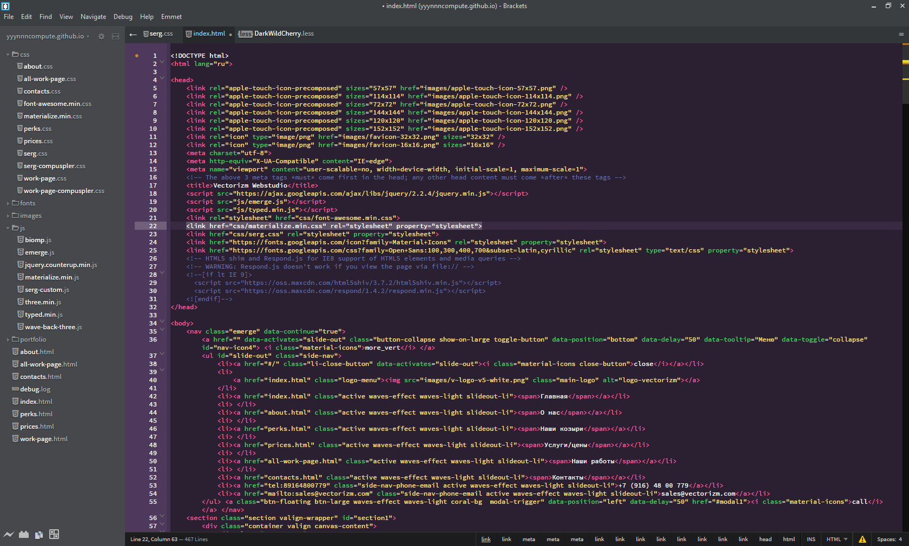
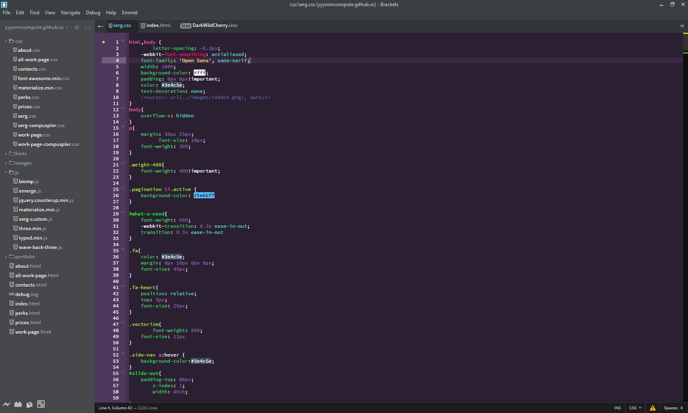

# Dark Wild Cherry Brackets Theme

* Dark Wild Cherry is a juicy, high contrast theme, that is easy to read. Original made by Omar Mashaal. This version is slightly customized. "A fairy-tale inspired theme, with tasteful use of emojis - Zsh, iTerm, Sublime, Atom, Slack, Mou, PuTTY, & Notepad++"

# Recommended Extensions

* [Show Whitespace](https://github.com/DennisKehrig/brackets-show-whitespace)
* [Whitespace Normalizer](https://github.com/dsbonev/whitespace-normalizer)
* [Show Git Branch for project](https://github.com/couzteau/brackets-git-info)

# Installation

Visit http://brackets-themes.github.io/ to see the latest install instructions.

# Troubleshooting

1. Things look "weird"
    1. Try hitting F5 (Save changes before doing so!).

# Contributing

* Please see [`CONTRIBUTING.md`](CONTRIBUTING.md) if you would like to help.

# Screenshots

The following screen shots were not taken on a clean install but instead using some of the recommended extensions above.

### HTML

### CSS

### JavaScript

